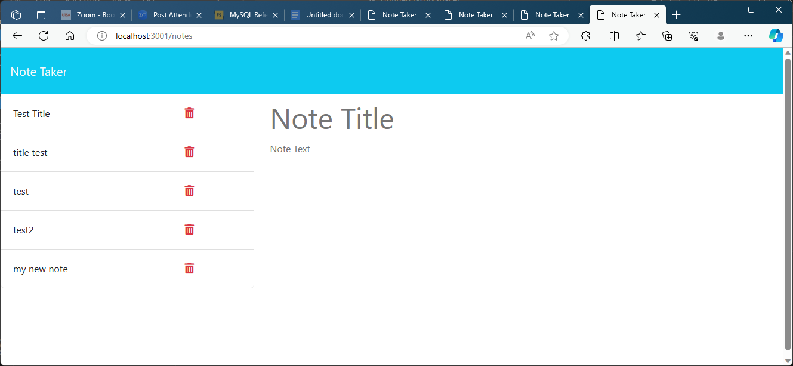

# <note taker>

## Description

this app is a note taking app that has the functionality to take notes and save them to an api and recall them.

github repostiory : https://github.com/N-lara/note-taker

## Table of Contents (Optional)

- [Installation](#installation)
- [Usage](#usage)
- [Credits](#credits)
- [License](#license)

## Installation

to install this git clone it from git hub and once it is cloned then npm install the required files then node server.js and open the server (or access it on heroku)

## Usage

this app can be used to create notes to use later on knd keep track of them

## Credits

this was made by Noah ara with some starter code from UTSA coding bootcamp and the aid of the creaters of node and express

## License

N/A

## How to Contribute

in the future i would like to add functionality to the delete function